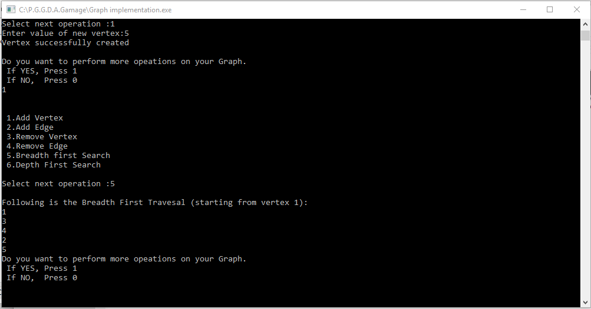

# P.G.G.D.A.Gamage

### Graph Data Structure Implementation

There are two standard ways of represent a graph G =(V,E):
			Adjacency Matrix
			Adjacency List

Either way applies to both directed and undirected graphs.

In this program all the basic functionalities have been implemented using adjacency list representation.

The adjacency list representation of a graph G =(V,E) consists of an array Adj of |V| lists,one for each vertex in V.For each u element of V , the adjacency list adj[u] contains all the vertices v such that there is an edge (u,v) element of E. That is, Adj[u] consists of all the vertices adajacent to u in G.
___

### Basic Operation on Graph Data Structure

* Create Graph 
* Add vertex 
* Add edge 
* Remove vertex 
* Remove edge 
* Breadth First Traversal 
* Depth first Traversal 

____
### Installation

* You can clone or download the repository .
* Download **Graph** folder.
* Open the project using Dev-C++ or any platform that supports C++.
* Compile and Run to perform required functions.
____
### Test Case

 

* Function tests are carried out based on above graph.

___
### Drawbacks
* Maximum 20 vertices

___
### Future Objectives

* Topological Sort
* Shortest Path Algorithm
* Classification of Edges
	* Tree edeges
	* Back edges
	* Forward edges
	* Cross edges 
* Strongly-Connected Components

____
### Contributions
* Fork the project and clone locally
* Open an issue or propose a Pull request

___
### License
* This project is licensed under the MIT License.See [LICENSE.txt](https://github.com/FOSSCODY-1/P.G.G.D.A.Gamage/blob/master/LICENSE.txt) file for detail.
    						
